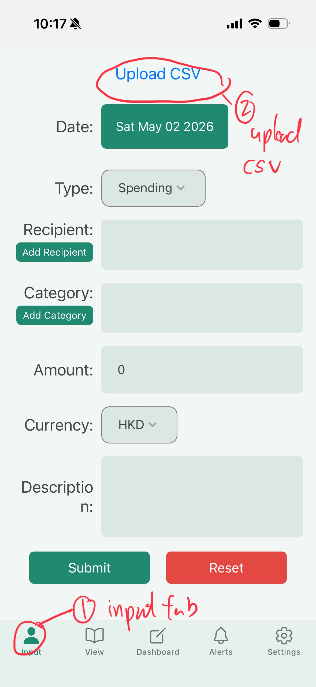
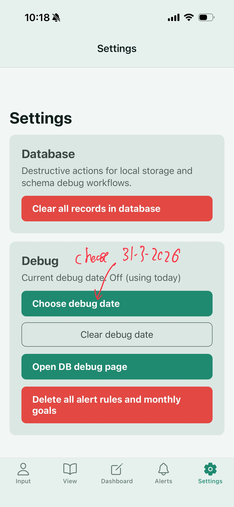

# Project Overview
This project uses react-native expo to create a budgeting app. 

# How to run

## Using Android to install directly with APK (Suggested)
[Click this link to download the apk](https://expo.dev/artifacts/eas/3Hdvc7b1QJw5FHcuxBdYwe.apk)

If this link failed, download the file [APK](Android_APK\application-68e0ce76-c286-4af5-bbf0-d96e97d51de9.apk). 

**If you don't have an Android, consider using emulators.**
- [Bluestacks](https://www.bluestacks.com/) 
- [Android Studio](https://developer.android.com/studio/install)  [Android Studio Guide](https://developer.android.com/studio/run/emulator)


## Expo Go
There are 2 ways to use expo go to test our app, both requiring downloading of complete source code. 

First, either `git clone https://github.com/Tranxpotter/COMP1110-G10-App.git` or download zip on github and unpack. 

### Local installation (Complicated)
Local installation can differ from devices, requries Node.js installation

- https://nodejs.org/en/download/ (install v24.xx.x LTS)

1. Run `npm install --f` in the root directory of the project code
2. Then run `npx expo start`
3. Download the app [expo go](https://expo.dev/go), and scan QR code with app (or scan with camera on IOS).
4. If you have an IOS phone, scan the QR code with your phone camera
5. If your phone was unable to connect to the app, try the command `npx expo start --tunnel`


### VSCode Devcontainer (Easier)
Requirements: [Docker](https://www.docker.com/products/docker-desktop/), [VSCode](https://code.visualstudio.com/)

1. Install [Devcontainer Extension](https://marketplace.visualstudio.com/items?itemName=ms-vscode-remote.remote-containers) in VSCode 
2. Open project root folder with VSCode
3. Reopen in Container
4. After the container finishes setting up, run `npx expo start --tunnel`
5. Download the app [expo go](https://expo.dev/go), and scan QR code with app (or scan with camera on IOS).
6. Wait for the app to bundle and test the app! (It can take a while)


## Download Expo go
Please download the required APP to run our app.
#### Android
[Android download link](https://play.google.com/store/apps/details?id=host.exp.exponent)
#### IOS
[IOS download link](https://apps.apple.com/app/id982107779)


## Testing the app with data sets 
<iframe width="560" height="315" src="https://www.youtube.com/embed/GAbYAX0jjck?si=mf_rd5Si1ar439I9" title="YouTube video player" frameborder="0" allow="accelerometer; autoplay; clipboard-write; encrypted-media; gyroscope; picture-in-picture; web-share" referrerpolicy="strict-origin-when-cross-origin" allowfullscreen></iframe>
```
Reminder: Set date to 31-3-2026 for every settings in debug date
```
Go to /testingdata/data [link](testingdata/data)

Note everytime after testing a case, go to settings and press clear all records in database.

## Steps in reproducing test cases (please download the required csv files in the links below first)
1. Go to input tab
2. Click upload
3. Select the csv file for this test case



4. Choose the debug date to 31-3-2026 for suitable test cases


5. Add suitable rule by pressing the add rule button, follow the configs in tables below for each test cases
6. Add suitable goal by pressing the add goal button, follow the configs in tables below for each test cases
7. After testing, go to settings page and remove all records by pressing the Clear all records in database button


### Ashley [File Link](testingdata/data/ashley.csv)
| Rule | Config |
|---|---|
| Spending Limit | categories = `[Dining, Shopping, Entertainment]`, threshold = HK$16,000, reset day 1 |
| Big 1-Time Payment | categories = `[Shopping]`, threshold = HK$4,000 |
| Recurring Payment | N = 15  |
| Extra Surplus | month-end residual ≥ HK$10,000 |

### anutie_mei [File Link](testingdata/data/auntie_mei.csv)
| Rule | Config |
|---|---|
| Spending Limit | categories = `[Groceries, Dining, Entertainment, Kids]`, threshold = HK$15,400, reset day 15 (payday) |
| Big 1-Time Payment | categories = `[Kids, Entertainment]`, threshold = HK$5,600 |
| Recurring Payment | N = 3  |
| Extra Surplus | month-end residual ≥ HK$1,200 |

### brandon [File Link](testingdata/data/brandon.csv)
| Rule | Config |
|---|---|
| Spending Limit | categories = `[Shopping, Dining, Subscriptions]`, threshold = HK$22,500, reset day 1 |
| Big 1-Time Payment | categories = `[Shopping]`, threshold = HK$9,000 |
| Recurring Payment | N = 3  |
| Extra Surplus | month-end residual ≥ HK$20,000 |
### kelvin [File Link](testingdata/data/kelvin.csv)
| Rule | Config |
|---|---|
| Spending Limit | categories = `[Dining, Entertainment, Shopping]`, threshold = HK$19,250, reset day 1 |
| Big 1-Time Payment | categories = `[Shopping, Entertainment]`, threshold = HK$7,000 |
| Recurring Payment | N = 3 |
| Projected Monthly Spending Alert | trigger day 15, exclude `Rent`, threshold = HK$35,000 |
| Extra Surplus | month-end residual = HK$4,000 |
### priya [File Link](testingdata/data/priya.csv)
| Rule | Config |
|---|---|
| Spending Limit | categories = `[Dining, Entertainment, Other]`, threshold = HK$16,000, reset day 1 |
| Big 1-Time Payment | categories = `[Other]`, threshold = HK$8,000 |
| Recurring Payment | N = 3 |
| Extra Surplus | month-end residual = HK$20,000 OR = 35% of monthly income |
| Monthly Savings Goal | `= 20%` |